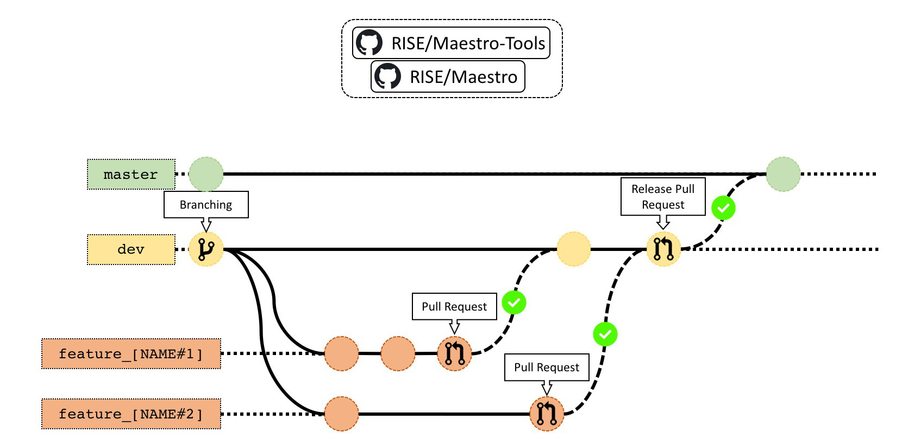

Git Workflow - Draft
============

## Intro

Of course there is no One True Way™ of working with code across teams, and no document should keep you from improving things or doing something you using your best judgment find necessary.

## Branches
### The Master Branch

The **master** branch should be considered sacred, the code should always be working and be ready to use. 

You should never work directly in master and never push to it from a local version or from any branch other than the **dev** branch. 

Generally nothing should happen in the the **master** branch unless there is a new release.

### The Development Branch

The **dev** branch is from where everyone branches off and merges in most of their new code. 

As with the master branch it should always be working, but not necessarily be ready for release. 

Try to never write code directly to this branch. Make a pull requests from the relevant feature branch  and assign one or two developers to review the code. 

### Feature Branches

When working on a new feature a **feature** should be created from the **dev** branch, or from another **feature** branch if continuing on previous work.

Try to make pull requests from a working branch and assign one or two developers to review the code. 
Feature branches should be named: `feature_[branch_name]`

### Bug Fix Branches

When resolving a bug, follow the same procedure as for **feature** branches, but name the branch according to: `bugfix_[branch_name]`

## New Code

### Create a New Branch

1. Update the **master**, **dev** and/or **feature** branches to latest version(s)
2. Create branch
    - Avoid creating large pull requests.
    - Divide your work into smaller branches to facilitate continuous reviewing.
    - Names should be kept short and descriptive. 

### Pushing and Committing Changes

1. Make changes
   
    - Make sure everything is running (build, tests, etc)
    
2. Pull branch for any changes (If not working alone on specific branch) and check util-repo for any changes.

3. Commit with descriptive name
   
    * Good example: "Function X handles strings as well."
    
    - Bad example: "Updated function X"
    
4. Push often, at least once a day.

## Pull Request

Open a pull request into the relevant branch (usually **dev**)
    * Write a descriptive title of the implemented feature
    * Bullet points with descriptions of changes
    * Ensure that your branch is up-to-date with base branch.
    * Add one or two people as reviewers to pull-request. 
    * Only assign entire Github team if everyone in said team can understand the code (reviewers: not being assigned does not mean you cannot review!).

### Code Review

**As a reviewer** of a pull request, it is important that you provide constructive and precise feedback. We strive to improve both our own method and the code base. You overarching goal as a reviewer is not to verify that the code functions, which is easily done by the author. Instead it is to make sure that the code is written in a sustainable way, concerning readability as well as functionality.

If it is confusing to you, it is probably confusing to everyone else (including the author, after some time).

Some examples of what to look for or do is:
1. Review the code and leave constructive input as necessary.

2. Check the code structure. For every second spent writing code, a developer spends ten seconds reading code. For example:

      * Is a triple nested ternary really necessary or is a two liner easier to comprehend?

      * Is it really necessary to have 8 input arguments or is the function better split into several?

3. Naming of functions, variables and classes.

4. Code generality
    - Is the code written in such a way that it is reusable somewhere else?
    - Is the code written in such a way that  its functionality could be tested easily?

5. Ask yourself: "What if?" For example:

      * "What if the input is a null pointer?"
      * "What if this number is outside of an expected range?"
      * "What if this system function call returns an error?"

6. Be precise in your comments
      * Bad example: "this feature doesn't address the problem"
      * Good example: "this feature doesn't address the problem *because* ---"

7. Make use of the "make suggestion" feature of GitHub!

      

When you begin a review, assign yourself to the pull request so others can see the review is in progress.

When you are done reviewing, make sure to do one of three things. 
1. If you think something should change, make a change request. 
2. If everything looks good, or only minor changes are needed, approve the pull request.
3. If you are engaging in a discussion or some clarification is needed, comment on the pull request.

**As author** of a reviewed pull request, it is important to be open to feedback: see a review as an opportunity to learn from the reviewer and improve your method rather than as a critique of your work! You are expected to adhere to the following points:

1. You are responsible for making any necessary fixes as suggested by the reviewers and pushing them up. 
2. The reviewer put time and effort into your pull request, trying to make the best possible product. Do not dismiss their comments out of hand.
3. Be active in the discussions and feedback. Your work is not done until the review has passed.
4. Re-request a review if you feel you have addressed all review points adequately.

### Merging Code

Once you have had enough people review it, you are confident in the code you have written, and everything is well tested and passing, you can merge your pull request. Make sure to delete the branch after it has been merged.

### Documenting Changes for Release
Go to [releases](https://github.com/RI-SE/Maestro/releases) and add your pull request to the current release draft. Also remember to add the change to the changelog.md file in Maestro/Maestro-Tools. 

If the change warrants it increase the version number. 

## Additional stuff and resources

- [A Successful Git Branching Model](http://nvie.com/posts/a-successful-git-branching-model/)
- [Understanding the Git Workflow](https://sandofsky.com/blog/git-workflow.html)
- [Github: Understanding the Git Flow](http://guides.github.com/overviews/flow/)
- [Issues with Git Flow](http://scottchacon.com/2011/08/31/github-flow.html)
