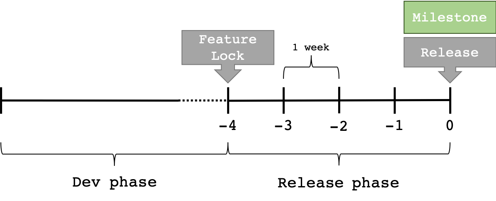

#  Release Procedure

A new release procedure is started once a milestone has been accomplished and a new one has been set. Within the release procedure there are two phases; a development phase and a release phase. The development phase is focused on creating new features which are needed to achive the milestone while the release phase focues on refining and testing Maestro such that it can be released as a stable version. The release phase is 4 weeks long and during this period and before this period starts, the amount of features are locked. This is illustrated in the picture below:



## Definition of a Release

A release is the process of moving code from the `dev` branch to the `master` branch and creating a release on the [Maestro Github repository](https://github.com/RI-SE/Maestro/releases). A release should contain the software needed to successfully run Maestro on a computer.

# Development Phase

```
feature -> dev
```
Testing should be documented through a lightweight protocol
* Complete a normal test with one virtual test object
* Complete a normal test with two virtual cars
* Complete a aborting test with two virtual cars


# Release Phase
```
dev -> master
(dev -> chronos) testing requirement on this merge might not be as extensive
```
A set number of test cases should be performed and documented. These tests are conducted with the use of real objects (for example using the RC-car).

The following documentation should be updated during a release phase:
* Maestro Documentation
* User Guide
* Test documentation which contains
    - Test description
    - Test result
    - Test person

The release documentation on github should be created containing:
* Version number #
* Change log (what has changed since last release?)
* Compatibility
  - GUC version number #
  - Virtual Object version number #
  - util version number #
* Known bugs

