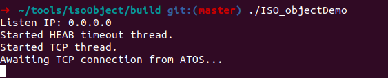
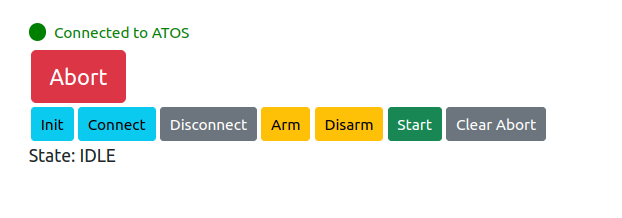
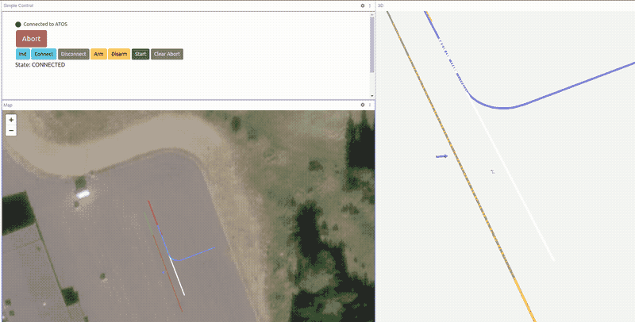

#### Prerequisites
Make sure you have installed ATOS by following the instructions in the [Installation](installation.md) section.

-------------------------

# Quick start

This section will walk you through the steps of starting the ATOS server for the first time. 

* Start ATOS by running either one of the docker commands (or with "ros2 launch ..." if you have installed it locally). In this guide, the docker compose command is used.```

        
        /<git_repo_path>/ATOS $ docker compose up
        (or if you are not in the docker group)
        /<git_repo_path>/ATOS $ sudo -E docker compose up
       

* Make sure the folder ~/.astazero/ATOS/ was created on the host machine. Since it was created by docker you will need to change the owner to your own user. Run the following command on the host machine:

       
        sudo chown -R $USER:$USER ~/.astazero/ATOS/
        

* Download and build the ISO_objectDemo binary from the [isoObject repo](https://github.com/RI-SE/isoObject). Follow the build instructions and execute the binary ISO_objectDemo in the build folder. (This object is not controllable but will respond to control messages from ATOS. It is used to test the connection between ATOS and the object.)

    

* Open a web browser and go to [https://localhost:3443](https://localhost:3443). You should see a page warning about NET::ERR_CERT_AUTHORITY_INVALID. This is because the certificates we create are self signed. Click on "Advanced" and then "Proceed to localhost (unsafe)". Now you should see the ATOS control panel.

    

* In your browser, go to [Foxglove studio](https://studio.foxglove.dev/). Press Open connection -> Rosbridge. Enter WebSocket URL wss://localhost:9090. Press Open. You should now see ROS topics in the left panel named "Topics". 

* Install the foxglove ATOS extensions from the ATOS repo. Do this by draging the .foxe files from the folder /{repo_path}/ATOS/plugins/foxglove/ into the Foxglove studio browser window.

* Install the ATOS layout by chosing Layout -> "Import from file" and select the file /{repo_path}/ATOS/plugins/foxglove/Map, 3D and control layout.json.

* Press the buttons Init and Connect in the control panel. You should now see several trajectories and an object appear in the 3D view. 



