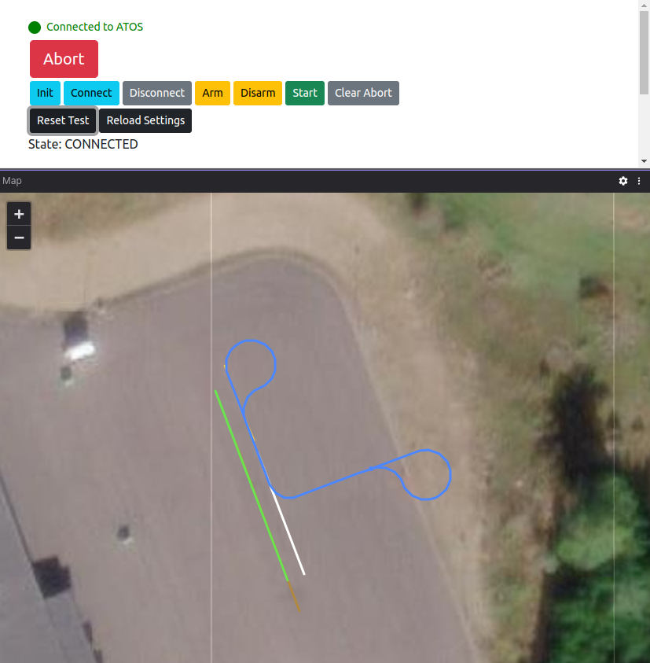

# BackToStart
A module for generating an object's return trajectory.

WARNING: It is up to the operator to determine if the new trajectories are possible to execute or not since the generated trajectories doesn't take other objects' trajectories into consideration.

## About the module
This module provides a service that enables resetting test objects to their starting position after a completed test.
The service calculates Williamson turns on both ends of the original trajectory, which if followed by the test object will lead it back to the start of the original trajectory, with a correct heading.

1. Init your test: `Init`->`Connect`.
2. Execute test: `Arm`->`Start`.
3. Abort the test after it's finished: `Abort`->`Clear Abort` (You will end up in `Connected` state and ready for `Arm`).
4. Return the test objects to starting position: `Reset Test`->`Arm`->`Start`.
5. Abort reset after objects have returned: `Abort`->`Clear Abort`.
6. Reload scenario settings: `Reload Settings`. 
7. You are now ready to execute your test again: return to step 2. 

The service is only allowed in `CONNECTED` state and does not result in a state change. Images below show before pressing `Reset Test` (left) and after (right), the state remains in `CONNECTED`.

